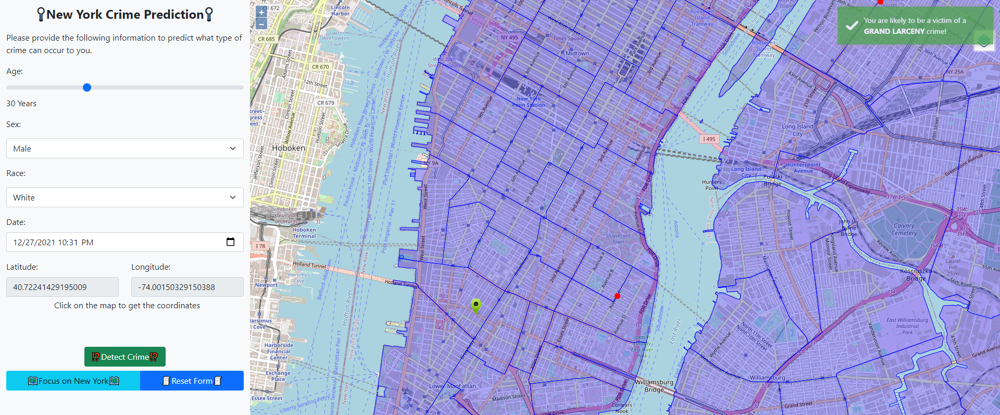

# Location Analytics Project: New York Crimes Prediction

## This project was developed by:
- Alaeddine DHAOUI
- Mohamed CHIBOUB

In order to run the project, please install the following Programs:
- Redis, if you're using Windows, please use the following [tutorial](https://dev.to/divshekhar/how-to-install-redis-on-windows-10-3e99).
- Python packages, use the following command: `pip install fastapi uvicorn[standard] numpy pandas tensorflow aioredis fastapi-cache2`

Once installed, start by navigating to the `backend`folder and running the `uvicorn main:app --reload`commnand to start the backend server. Then navigate to the `frontend`folder and launch the contents of that folder into a web server (if you are using VSCode, use the Live Server extension).

